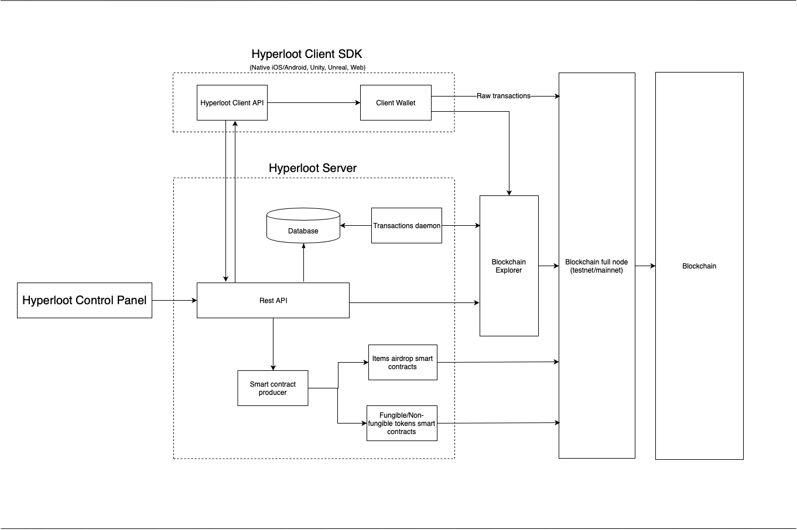

# High-level Architecture

Hyperloot protocol is aiming at allowing developers to convert their in-game/in-app assets into tradable tokens and enabling in-app trading using blockchain technology. To achieve that Hyperloot architecture is based on its own backend and additional blockchain layer.

Hyperloot protocol defines 2 main components which interact with each other and with blockchain at the same time: Hyperloot Client and Hyperloot Server. Hyperloot Server is designed to handle all token issuances and to store basic information about user's tokenized assets. Obviously this information could be fetched from blockchain but the purpose of having it on the server is for synchronizing tokens and assets. There's no intention to make the system centralized. Hyperloot Client implements an API on the client side which interacts with Hyperloot Server and blockchain under the hood. Client SDK could be implemented for any popular platform e.g. Native iOS/Android, Unity, Unreal, Web, Desktop - there are no platform restrictions.

### Token Control Panel, Hyperloot Developer's Account, App Management, Token Management

There's also one important component which is connected with Hyperloot Server - Token Control Panel (TCP). It's a admin tool with user interface and entry point for every developer. 

A developer before issuing tokens should register a developer's account and create an App in Token Control Panel. App creates a configuration to give an access to Client SDK - AppKey and AppSecret. Converting developer's assets into tokens happens in Token Control Panel. Tokens data which is not a shallow copy from blockchain will be stored in the database and linked to the App. Therefore, a developer could see all tokens related to the project and do an airdrop if necessary right in Token Control Panel. TCP consumes public Hyperloot REST API to operate with Hyperloot Server. On blockchain level developer's tokens are just regular tokens that are available for all users to buy/sell via exchanges or send to/receive from other users via 3rd party wallets.

## Hyperloot Server

### REST API and Database
REST web services is the main entry point for Client SDK and Token Control Panel. It provides an access to the information about tokens and users which is stored in database. 
Database doesn't contain full information about users from the developer's project standpoint, there are only basic parameters like owned assets, wallet address for serving protocol needs. API returns the data only per app via AppKey/AppSecret, it's not possible to developer to get the data about all projects from the database.

### Blockchain Explorer
This module helps the SDK to get public information about wallets, balances from blockchain to synchronize with existing data in database if needed. Database doesn't have cloned information from blockchain, this is necessary for getting blockchain data faster and in a secure way. Private keys are belong to user and they are not stored on the server in any way.

### Smart contract producer
This module creates and publishes smart contracts on blockchain. This is necessary for issuing unique tokens for assets (like ERC-721 in Ethereum) and running massive airdrops campaign after issuing tokens in an efficient way. It’s not working with blockchain directly - blockchain node should be set up on the server.

### Transactions daemon
Typically it takes some time to verify transactions on blockchain by nodes. Hyperloot Server creates an object for each transaction with hash and adds this object to daemon's queue. Daemon works in a loop to check pending transactions statuses and then instantly update all necessary relationships between objects in the database. It guarantees that the client will get up-to-date information on startup if the game/app is not launched or before making a transaction. 

## Hyperloot Client

Client SDK interacts with Hyperloot Server and blockchain in parallel. It provides an API for developer's project (game/app) to support full cycle of token trading: registering internal Hyperloot user, fetching user's assets, transferring user's assets. All blockchain transfer operations are basically raw transactions to a full node signed with private keys stored on a device. Blockchain explorer helps to get information faster and in the most efficient way to reduce demand on blockchain - usually data structures are not designed to get relations between tokens/transactions/etc. easily.

Client also has similar transactions daemon like on the server which checks only current user's transactions. If transaction is verified by nodes then the Client will perform a handshake - an API call to synchronize the data between Client and Server to make sure that everything is up-to-date. 
